# Black Box Optimization.

2D Implementation of: 
- Compass Search
- Cyclic Coordinate Search
- Powells Method
- Hooke-Jeeves
- Generalized Pattern Search
- Nelder-Mead Simplex Method
- DIvided RECTangles (DIRECT)
- Mesh Adaptive Direct Search (MADS)
- Covariance Matrix Adaption Evolutionary Strategy (CMA-ES)

On benchmark functions:
- Ackley function
- Eggholder function
- Cross in tray function

## Optimization Paths.

### Compass Search
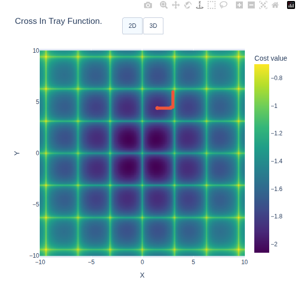
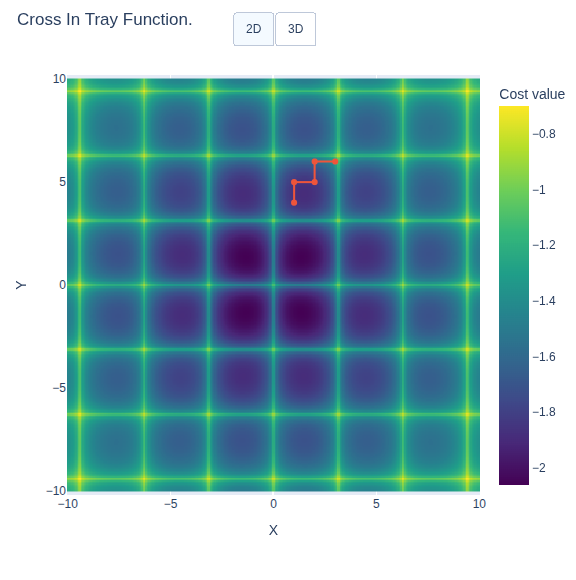
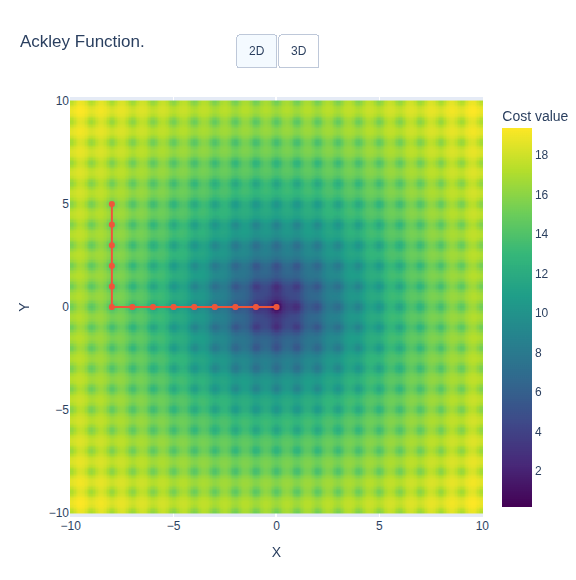

### Cylic Coordinate Search

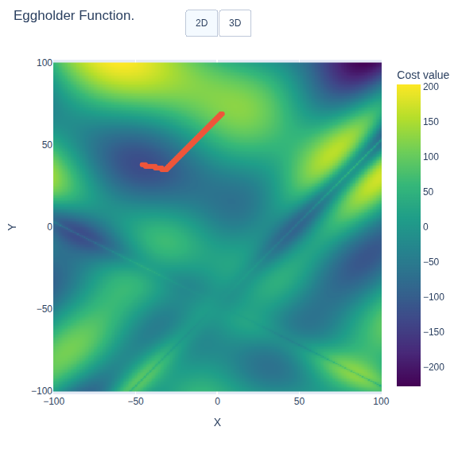
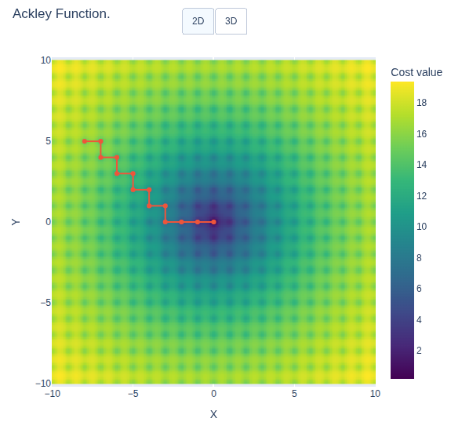

### Powells Method
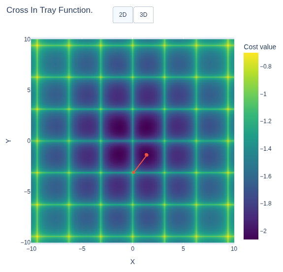
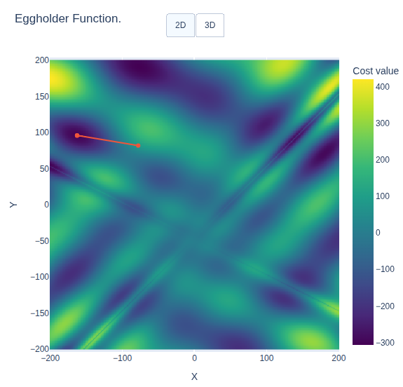
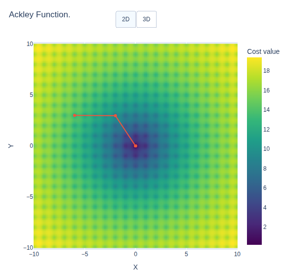

### Hooke-Jeeves
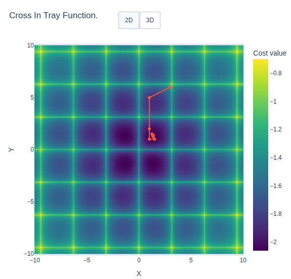

### Generalized Pattern Search
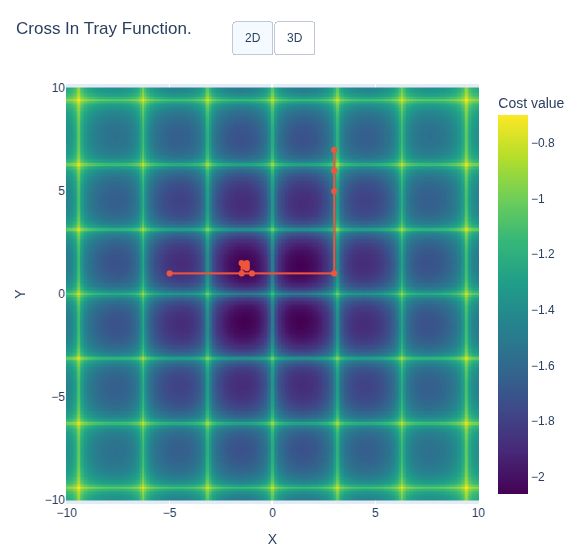
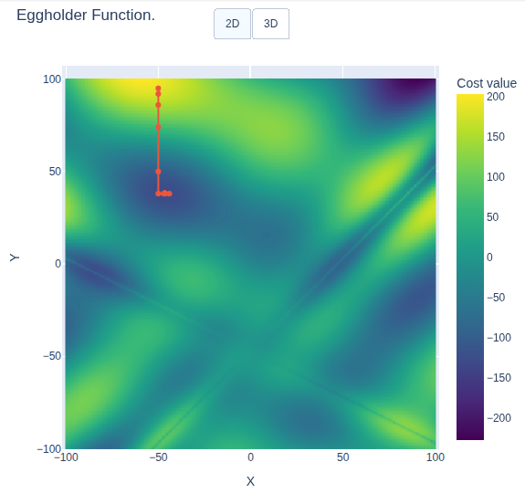

### Nelder-Mead Simplex Method

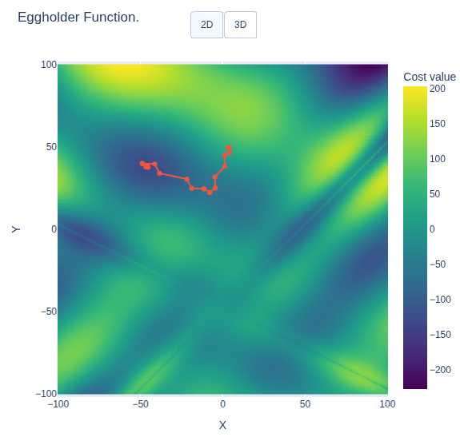
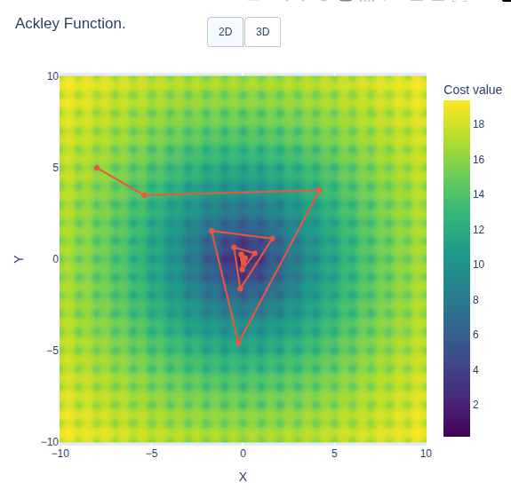

### DIvided RECTangles (DIRECT)
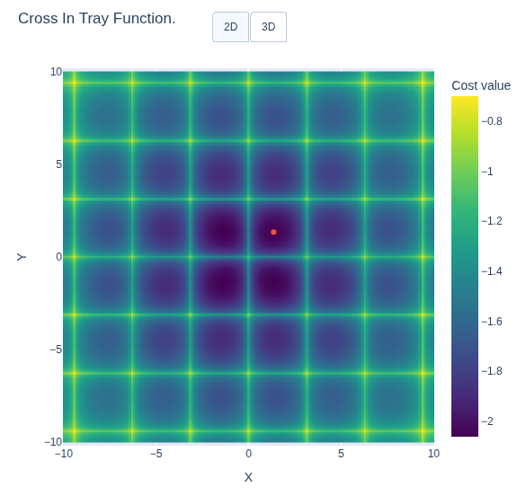
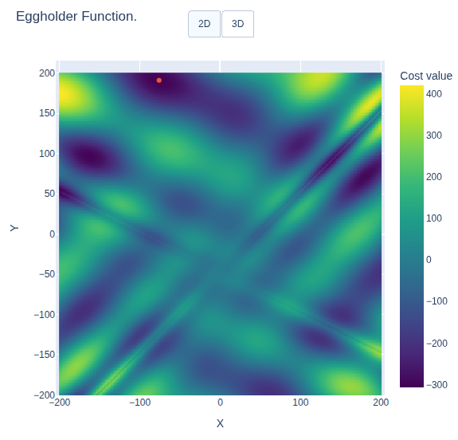
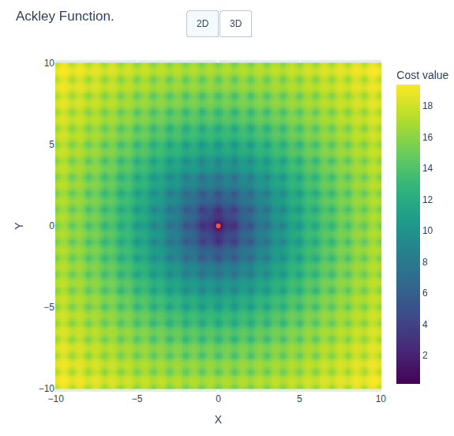

### Mesh Adaptive Direct Search (MADS)
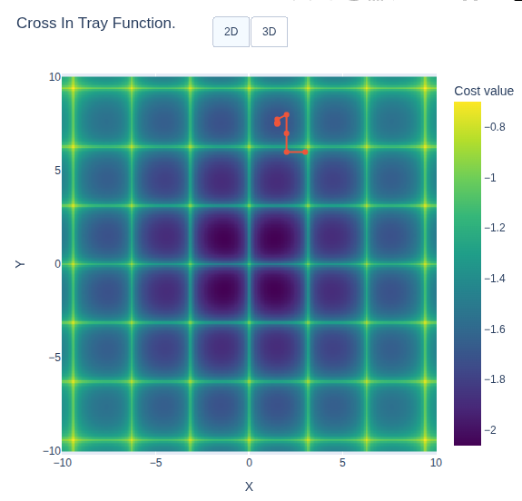
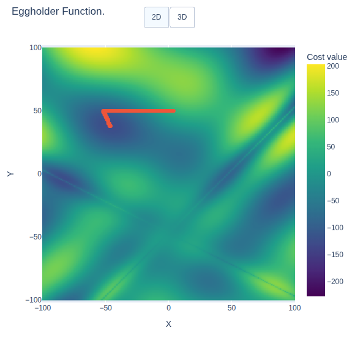
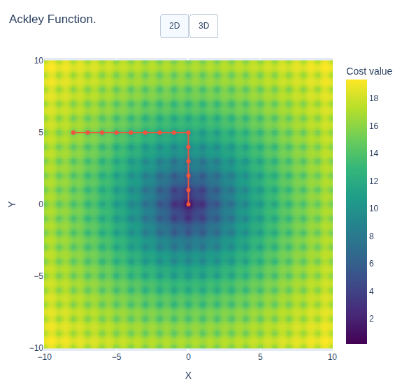

### Covariance Matrix Adaption Evolutionary Strategy (CMAE-ES)
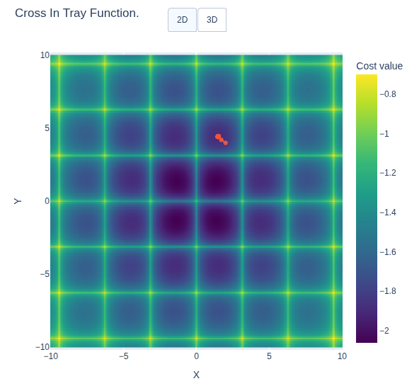
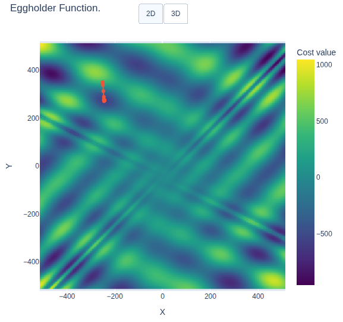
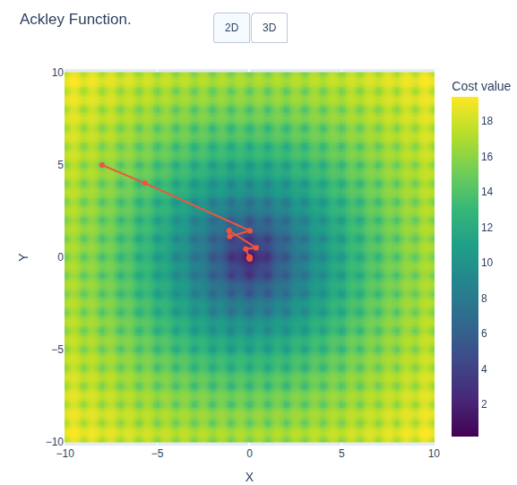
